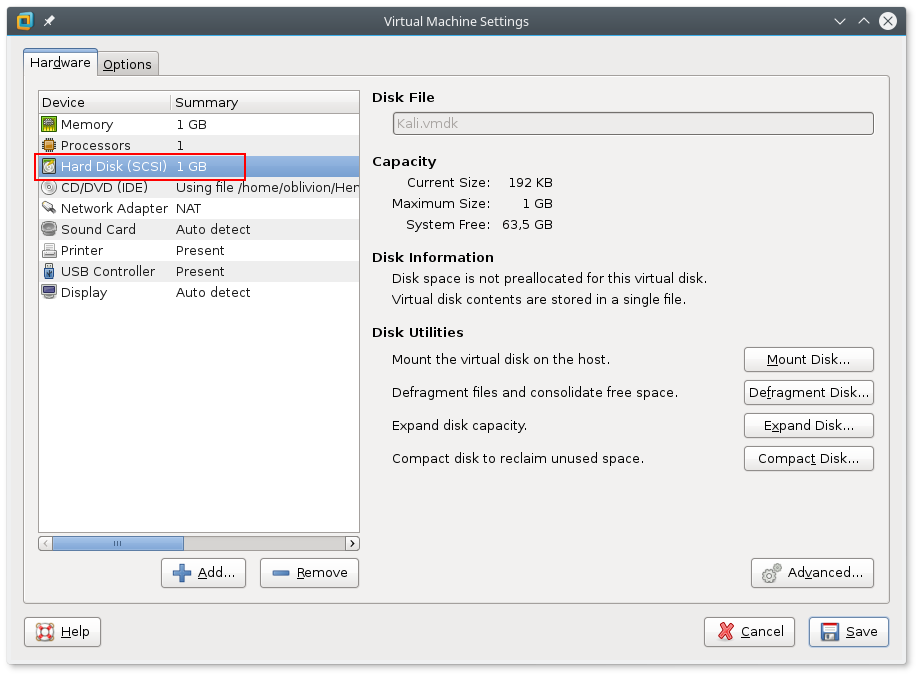

# Recovery Documentation
## Project network

# 1.  Introduction

This document describes the steps needed to create project network. The latest version of this document is available at [https://github.com/deadbok/project_network](https://github.com/deadbok/project_network)

# 2.  Overview

This are the overall steps in recreating the system from scratch.
Software sources
Create virtual machines and install OSs if needed
Define the interfaces on each machine and link them together
Configure internal router
Configure internal server for DHCP
Configure the external router
Configure the external server for HTTP services
Configure internal machine for local DNS resolution

# 3.  Software sources:

These are the links to the external resources that has been downloaded to get things working:

[MWare Workstation 12 Pro](http://www.vmware.com/products/workstation/workstation-evaluation.html)
[JunOS SRX VMWare virtual machine OVF](https://fronter.com/eal/links/files.phtml/2080432588$548107012$/1st+Semester/Data+Communication/Software/junos-vsrx-12.1X47-D15.4-domestic.ovf)
[JunOS SRX VMWare virtual machine VMDK](https://fronter.com/eal/links/files.phtml/2080432588$548107012$/1st+Semester/Data+Communication/Software/junos-vsrx-12.1X47-D15.4-domestic-disk1.vmdk)
[Debian net installer ISO](http://cdimage.debian.org/debian-cd/8.6.0/amd64/iso-cd/debian-8.6.0-amd64-netinst.iso)
[Kali Linix 64-bit ISO](http://cdimage.kali.org/kali-2016.2/kali-linux-2016.2-amd64.iso)

# 4.  Creating the Virtual Machines and install their OSs

When creating the virtual machines do not bother with the network configuration at this time.

## 4.1.  CLIENT-USRLAN (Kali client)

The Kali client is a Live CD and is run directly from the ISO image, with no persistent storage. When setting up this machine in VMWare, create a custom machine (as shown in Illustration 1) with no emulated hard drive.


Add the ISO image to the virtual machine in the screen after that, and on the next screen select the OS as shown in Illustration 2.


On the following screen enter the name CLIENT-USRLAN. Set the amount of memory to no less than 1024MB or Kali will complain. VMWare insísts on creating a virtual hard drive, but since Kali is running from a live image, you are free to delete this virtual drive when the machine is created (see Illustration 3)



## 4.2  SERVER-SRVLAN-DNS & SERVER-DMZ-WEB (Debian netinst)

To create the virtual machines for the Debian server, just click through the guided VM creation, in VMWare. There are only three changes, remember to select the debian-8.6.0-amd64-netinst.iso, for the installation media, set the correct machine name, and decrease the virtual hard drive to 2GB, to not waste space.
When installing the Debian GNU/Linux remember to have a working Internet connection in the VM, because the netinst image fetches most of the Debian packages from the Internet. When the Debian installation asks for the hostname, use the name from the naming convention. Set the domain to “localnet”.

## 4.3  ROUTER-EXT & ROUTER-INT (JunOS SRX VM)

The downloaded files has a VMWare “.ovf” file that you can open from the VMWare file menu. Rename the machine “ROUTER-EXT”. Create a full clone of the “ROUTER-EXT” machine and name that one “ROUTER-INT”. The JunOS operating system is all ready installed on the image, so for these machines there are no OS installation step.

# 5  Configuring the virtual machines

## 5.1  General setup of the Debian servers

To login to the server to install the configuration files an SSH connection to the virtual machine has to be established. To do this follow these steps:

## 5.1.1  Setup SSH for root logins over the network

Login as root and edit `/etc/ssh/sshd_config`, find the following line:
```bash
PermitRootLogin without-password
```
and change it to:
```bash
PermitRootLogin yes
```
Save the file and then restart SSH service:
```bash
service ssh restart
```

## 5.1.2  Add another network card to the virtual machine

Open the properties for the virtual machine, and add another network card with a Host-only connection.


After these steps simply get an address for the new interface on the server vm. There is no need to make any more changes to configuration files since this is a temporary management connection.
To get an IP address for eth1 (assuming this is the name of the new network device) in the server vm run the following as root:
```bash
dhclient eth1
```
When the command finishes run ip addr, to learn the address assigned by DHCP:
```bash
ip addr
```
The output looks like this:


To ssh from the host to the vm server use the following command (with the actual IP address of the server):
```bash
ssh root@172.16.189.128
```


## 5.2  CLIENT-USRLAN (Kali client)

The client boots of the ISO image and does not need any configuration.

## 5.3  ROUTER-INT

## 5.4  SERVER-SRVLAN-DNS
