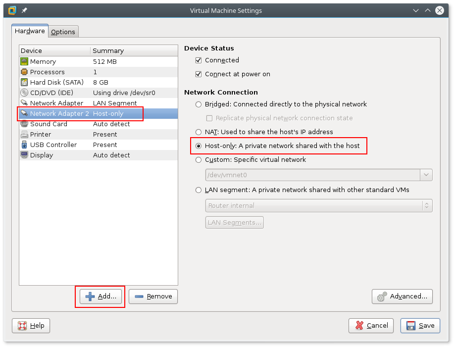
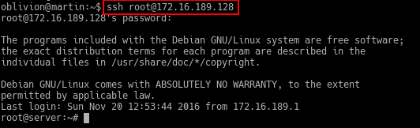

# Recovery Documentation
## Project network
**Version 0.9.2**

# 1 Introduction

This document describes the steps needed to create project network.

The latest version of this document is available at:
[https://github.com/deadbok/project_network](https://github.com/deadbok/project_network)

Project web page:
[https://deadbok.github.io/project_network/](https://deadbok.github.io/project_network/)

# 2 Overview

This are the overall steps in recreating the system from scratch.
- Software sources
- Create virtual machines and install OSs if needed
- Define the interfaces on each machine and link them together
- Configure internal router
- Configure internal server for DHCP
- Configure the external router
- Configure the external server for HTTP services
- Configure internal machine for local DNS resolution

# 3 Software Sources:

These are the links to the external resources that has been downloaded
to get things working:

- [MWare Workstation 12 Pro](http://www.vmware.com/products/workstation/workstation-evaluation.html)
- [JunOS SRX VMWare Virtual Machine OVF (Limited to EAL.DK Students)](https://fronter.com/eal/links/files.phtml/2080432588$548107012$/1st+Semester/Data+Communication/Software/junos-vsrx-12.1X47-D15.4-domestic.ovf)
- [JunOS SRX VMWare Virtual Machine VMDK](https://fronter.com/eal/links/files.phtml/2080432588$548107012$/1st+Semester/Data+Communication/Software/junos-vsrx-12.1X47-D15.4-domestic-disk1.vmdk)
- [Ubuntu 16.04LTS Server Installer ISO](https://www.ubuntu.com/download/server/thank-you?version=16.04.1&architecture=amd64)
- [Ubuntu 16.04LTS Desktop Installer ISO](https://www.ubuntu.com/download/desktop/contribute?version=16.04.1&architecture=amd64)

# 4 Creating The Virtual Machines And Install Their OSs

When creating the virtual machines do not bother with the network
configuration at this time.

## 4.1 CLIENT-USRLAN (Ubuntu Desktop Client)

For the Ubuntu Desktop, but also for the Server versions we will use VMWare VM Typical
settings, since it sets everything we need by default, even the network interface to NAT,
which is an essential feature needed in the OS install.
When setting up this machine in VMWare,
create a Typical custom machine (as shown in [Illustration 1](#illustration1))

<a name="illustration1">

</a>
> Illustration 1: Creating a Typical custom virtual machine

Setup will request adding a name for the machine, disk size, user and password
(this will mean we will be using a custom user, instead of default root).
Machine settings should resemble those in [Illustration 2](#illustration2).

<a name="illustration2">

</a>
> Illustration 2: VM Settings - CLIENT-USRLAN


## 4.2 SERVER-SRVLAN-DNS & SERVER-DMZ-WEB (Ubuntu Server)

The Ubuntu Server Virtual Machines will follow the same steps as those we took
earlier with the [**CLIENT-USRLAN**](#illustration1).
Settings for both servers should resemple those [Illustration 3](#illustration3)
and [Illustration 4](#illustration4).

<a name="illustration3">

</a>
> Illustration 3: VM Settings - SERVER-SRVLAN-DNS

<a name="illustration4">

</a>
> Illustration 4: VM Settings - SERVER-DMZ-WEB

## 4.3 ROUTER-EXT & ROUTER-INT (JunOS SRX VM)

The downloaded files has a VMWare “.ovf” file that you can open from the VMWare file menu.
Rename the machine “ROUTER-EXT”. Create a full clone of the “ROUTER-EXT” machine and name
that one “ROUTER-INT”. The JunOS operating system is all ready installed on the image,
so for these machines there are no OS installation step.

# 5 Configuring the virtual machines

## 5.1 Add another network card to the virtual machine

As with the server, and SSH connection is needed to copy the configuration to the routers.
Open the properties for the virtual machine, and add another network
card with a NAT connection.


> Illustration 5:  Adding a network card using Host-only to allow connecting from the host.

To get an IP address for eth1 (assuming this is the name of the new
network device) in the server vm run the following as root:
```bash
sudo dhclient eth1
```
When the command finishes run ip addr, to learn the address assigned by DHCP:
```bash
ip addr
```
The output looks like this:


> Illustration 6: Server IP Address

To ssh from the host to the vm server use the following command (with the actual IP address of the server):
```bash
ssh root@172.16.189.128
```


> Illustration 7: Server SSH Connection

## 5.2 Configuring the router for SSH
To set up the router for SSH access the following configuration has to be set for the Host-only interface:

```bash
#Enter the cli
cli

#Enter edit mode
edit

# Set the root password
set system root-authentication plain-text-password 
New Password: type password here
Retype new password: retype password here

# Set the interface to DHCP
set interfaces ge-0/0/3 unit 0 family inet dhcp

# Delete the interface from the untrusted zone.
delete security zones security-zone untrust interfaces ge-0/0/3.0

# Put the interface in the trusted zone and allow all services
set security zones security-zone trust interfaces ge-0/0/3.0 host-inbound-traffic system-services all

# Allow all protocols
set security zones security-zone trust interfaces ge-0/0/3.0 host-inbound-traffic protocols  all

# Commit the changes
commit
```
## 5.3 CLIENT-USRLAN (Ubuntu Dekstop Client)

The client boots of the ISO image and does not need any configuration.

## 5.4 ROUTER-INT
To copy the configuration file onto the router when configured for SSH
access do like this:

```bash
scp router-int.conf root@172.16.189.133:~/.
```
Then on the router login and load the configuration:

```bash
# Enter the cli
cli

# Enter edit mode
edit

# Load the configuration that has just been copied to the 
# router.
load override router-int.conf

# Commit the new configuration
commit
```
**When the configuration has been loaded the password will be `test12`**

## 5.5 ROUTER-EXT
To copy the configuration file onto the router when configured for SSH
access do like this:

```bash
scp router-ext.conf root@172.16.189.133:~/.
```

Then on the router login and load the configuration:

```bash
# Enter the cli
cli

# Enter edit mode
edit

# Load the configuration that has just been copied to the 
# router.
load override router-ext.conf

# Commit the new configuration
commit
```
**When the configuration has been loaded the password will be `test12`**

## 5.6 SERVER-SRVLAN-DNS

 * Copy the configuration files into the server
 * Install dnsmasq
 * Enable the dnsmasq service

Install dnsmasq on the virtual machine:

```bash
# Install dnsmasq
apt-get install dnsmasq

# Enable dnsmasq at boot
update-rc.d dnsmasq enable

# Start the service now
service dnsmasq start
```

Copy the configuration files from the host to the virtual machine:

```bash
scp -r server-srvlan-dns/* root@192.168.206.132:/.
```

## 5.7 SERVER-DMZ-WEB

 * Install Nginx
 * Enable the Nginx service
 
Install dnsmasq on the virtual machine:

```bash
# Install dnsmasq
apt-get install nginx

# Enable dnsmasq at boot
update-rc.d nginx enable

# Start the service now
service nginx start
```

Copy the default HTML page to the server.

```bash
scp -r server-dmz-web/* root@192.168.206.130:/.
```

## 5.8 Network setup

This configuration uses the WMWare LAN segment feature. The LAN segments
created in the first virtual machine area available to the rest as well.

Open the settings for the virtual machine and navigate to the LAN
segment settings as shown in [Illustration 4](#illustration4).

<a name="illustration4">

</a>
> Illustration 4: Creating the LAN segments

Set the interfaces of the virtual machines according to [Table 1](#table1):

<span name="table1">&nbsp;<span>

|    Machine name   |   Interface 1   | Interface 2 |   Interface 3   |  Interface 4  |
|-------------------|:---------------:|:-----------:|:---------------:|:-------------:|
| CLIENT-USRLAN     | USRLAN          |     *nc*    |      *nc*       |      *nc*     |
| ROUTER-INT        | USRLAN          |    SRVLAN   | Router internal |      *nc*     |
| ROUTER-EXT        | Router internal |     DMZ     |      *nc*       |      *nc*     |
| SERVER-SRVLAN-DNS | SRVLAN          |     *nc*    |      *nc*       |      *nc*     |
| SERVER-DMZ-WEB    | DMZ             |     *nc*    |      *nc*       |      *nc*     |

*nc*: not connected.

> Table 1: Virtual machine interface connections.
