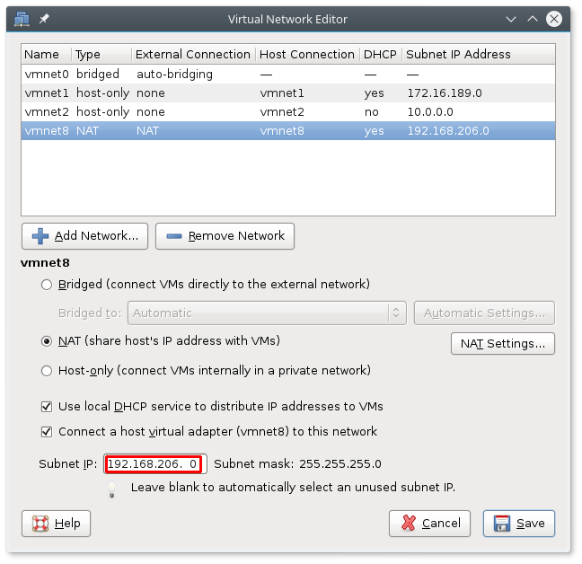
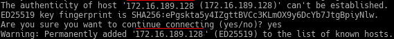
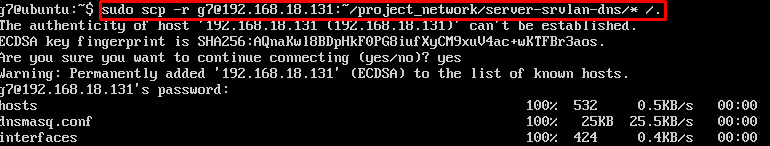

# Recovery Documentation
## Project network
**Version 0.9.6**

# 1 Introduction

This document describes the steps needed to create project network.
*It is assumed that you have a Windows 7/8/10 or a desktop Linux
distribution installed on the host machine as well as VMWare Workstation
12 Pro.*

The latest version of this document is available at:
[https://github.com/deadbok/project_network](https://github.com/deadbok/project_network)

Project web page:
[https://deadbok.github.io/project_network/](https://deadbok.github.io/project_network/)

# 2 Overview

This is the overall steps in recreating the system from scratch.
- Software sources
- Create virtual machines and install OSs if needed
- Define the interfaces on each machine and link them together
- Configure internal router
- Configure internal server for DHCP
- Configure the external router
- Configure the external server for HTTP services
- Configure internal machine for local DNS resolution

# 3 System Requirements

Based on the current status in recovery and testing stages, the following
hardware and software are a minimum requirement in order to run the
network. All mentioned software resources are pointing to official
manufacturer download locations and official Lillebaelt Academy
curriculum resources.

## 3.1 Hardware

- CPU: Dual-Core Processor with multi-threading and virtualisation.
- Memory: 8GB DDR3 Dual-Channel.
- Storage: 20GB HDD Free Space.

## 3.2 Software

**License Limited Software**
- Machine Virtualisation: [MWare Workstation 12 Pro](http://www.vmware.com/products/workstation/workstation-evaluation.html)

**Lillebaelt Academy Curriculum Resources**
- Network Routers: [JunOS SRX VMWare Virtual Machine OVF](https://fronter.com/eal/links/files.phtml/2080432588$548107012$/1st+Semester/Data+Communication/Software/junos-vsrx-12.1X47-D15.4-domestic.ovf)
- Network Routers: [JunOS SRX VMWare Virtual Machine VMDK](https://fronter.com/eal/links/files.phtml/2080432588$548107012$/1st+Semester/Data+Communication/Software/junos-vsrx-12.1X47-D15.4-domestic-disk1.vmdk)

**Open Source Software**
- Network Servers: [Ubuntu 16.04LTS Server Installer ISO](https://www.ubuntu.com/download/server/thank-you?version=16.04.1&architecture=amd64)
- Network Client: [Ubuntu 16.04LTS Desktop Installer ISO](https://www.ubuntu.com/download/desktop/contribute?version=16.04.1&architecture=amd64)

# 4 Creating The Virtual Machines And Install Their OSs

When creating the virtual machines do not bother with the network
configuration at this time. Set the first interface of each virtual
machine to NAT.

For the ROUTER-EXT connection to the Internet to work, the IP address
of the NAT network in VMware have to be configured to match the IP
address in the configuration of ROUTER-EXT.

Go to *Edit* -> *Virtual Network Editor* and change the Subnet IP to
`192.168.206.0` as shown in [Illustration 1](#illustration1)).

<a name="illustration1">

</a>
> Illustration 1: NAT network VMware address
`

## 4.1 CLIENT-USRLAN (Ubuntu 16.04LTS Desktop Client)

For the Ubuntu Desktop, but also for the Server versions use the VMWare
VM Typical settings, since it sets everything needed by default, even
the network interface to NAT, which is an essential feature needed in
the OS install and later software/service installation.
When setting up this machine in VMWare,
create a Typical custom machine (as shown in [Illustration 2](#illustration2)).

<a name="illustration2">

</a>
> Illustration 2: Creating a Typical custom virtual machine

Next select the downloaded Ubuntu Desktop ISO as the operating system
source (as shown in [Illustration 3](#illustration3)).

<a name="illustration3">

</a>
> Illustration 3: Selecting operating system source

Setup will request adding a name for the machine, disk size, user and
password. By filling in the user information a less privileged user will
be created. When logged in as this user you can temporarily change to
the `root` account, which is the superuser of the system that has access
to all of the OS and hardware. Machine settings should resemble those in
[Illustration 4](#illustration4).

<a name="illustration4">

</a>
> Illustration 4: VM Settings - CLIENT-USRLAN


## 4.2 SERVER-SRVLAN-DNS & SERVER-DMZ-WEB (Ubuntu 16.04LTS Server)

The Ubuntu Server Virtual Machines will follow the same steps as those
of creating the [**CLIENT-USRLAN**](#illustration2), except using the
downloaded Ubuntu Server ISO as the operating system source
(as shown in [Illustration 5](#illustration5)).

<a name="illustration5">

</a>
> Illustration 5: Selecting operating system source

Settings for each server should resemble one of [Illustration 6](#illustration6)
or [Illustration 7](#illustration7).

<a name="illustration6">

</a>
> Illustration 6: VM Settings - SERVER-SRVLAN-DNS

<a name="illustration7">

</a>
> Illustration 7: VM Settings - SERVER-DMZ-WEB

## 4.3 ROUTER-EXT & ROUTER-INT (JunOS vSRX 12.1)

Open the downloaded `junos-vsrx-12.1X47-D15.4-domestic.ovf` using the VMWare
file menu. Rename the machine “ROUTER-EXT”. Create a full clone of the
“ROUTER-EXT” machine and name that one “ROUTER-INT”. The JunOS operating system
is already installed on the image, there are no further OS installation steps for
these machines.

# 5 Configuring the virtual machines

The CLIENT-USRLAN client is connected to the internet to clone this
repository, the configuration files needed for the servers and routers
are then copied from CLIENT-USRLAN to the individual machines.

*You can switch the keyboard layout from the Ubuntu Desktop terminal by entering
the following command (which will set the layout to Danish):*

```bash
setxkbmap dk
```

Enable remote SSH connections by installing the service.

```bash

# Install ssh
sudo apt-get install ssh

# Enable ssh at boot
sudo update-rc.d ssh enable

# Start the services now
sudo service ssh start
```

## 5.1 Cloning the git repository to CLIENT-USRLAN

First start “terminal“ and install git to CLIENT-USRLAN as shown in
[Illustration 8](#illustration8).

```bash
sudo apt install git
```

<a name="illustration8">

</a>
> Illustration 8: Installing git on CLIENT-USRLAN

then clone this repository onto the CLIENT-USRLAN and change in to the directory
where the repository was cloned as shown in
[Illustration 9](#illustration9).

```bash
git clone https://github.com/deadbok/project_network
cd project_network
```


<a name="illustration9">

</a>
> Illustration 9: Installing git on CLIENT-USRLAN

After this is done leav e the client as it is for now and go on to the
next step.

## 5.2 Configure the routers

The goal of these steps are to get the routers online on the NAT network,
temporarily, to copy the configuration files from the git repository now
present on CLIENT-USRLAN.

First the default network setup of the Virtual Machine is changed to allow
a connection to the same NAT network that CLIENT-USRLAN is connected to. The
default configuration is shown in [Illustration 10](#illustration10).

<a name="illustration10">

</a>
> Illustration 10: Default router network configuration

Change the first network adapter to `NAT` and disable the rest by unchecking
`Connect at power on` as shown in [Illustration 11](#illustration11). Do not
disable the first network adapter in the VM though it could seem like it needs
to be.

<a name="illustration11">

</a>
> Illustration 11: VM configuration for router NAT access

### 5.2.1 Configure the routers for DHCP on the NAT

The default login for the new routers are `root` and an empty password.

**These steps are to be carried out on both ROUTER-EXT and ROUTER-INT.**

```bash
#Enter the cli
cli

#Enter edit mode
edit

# Set the root password
set system root-authentication plain-text-password
New Password: type password here
Retype new password: retype password here

# Set the interface to DHCP
set interfaces ge-0/0/0 unit 0 family inet dhcp

# Delete the interface from the untrusted zone.
delete security zones security-zone untrust interfaces ge-0/0/0.0

# Put the interface in the trusted zone and allow all services
set security zones security-zone trust interfaces ge-0/0/0 host-inbound-traffic system-services all

# Allow all protocols
set security zones security-zone trust interfaces ge-0/0/0 host-inbound-traffic protocols all

# Commit the changes
commit

# Exit edit mode
exit

# Exit the cli
exit

# Show the important part of the connection information for ge-0/0/0
ifconfig | grep -A2 ge-0/0/0
```

The last command will print the IP of the interface ge-0/0/0 that will be used
to push the configuration file to the router.

<a name="illustration12">

</a>
> Illustration 12: IP address of the router on the NAT network

### 5.2.2 Push the configuration file to the router via SSH

*These steps are carried out back in CLIENT-USRLAN.*

The specific configuration file for each router is located here (on
CLIENT-USRLAN):

 * ROUTER-INT: `./router-int-conf/router-int.conf`
 * ROUTER-EXT: `./router-ext-conf/router-ext.conf`


To push the configuration file onto the router when configured for SSH
access do like this:

```bash
scp *router configuration file* root@*ip of router*:~/pn.conf
```
where:

 * `*router configuration file*` is the specific configuration file for the
   router as mentioned above.
 * `*ip of router*` is the specific IP address for the router as seen in
   [Illustration 12](#illustration12).

The first time an SSH connection is made, ssh will ask if the machine connected
to is actually the right machine as shown in [Illustration 13](#illustration13)

<a name="illustration13">

</a>
> Illustration 13: First time SSH connection

### 5.2.2 Commit the configuration file on the router

Login to the router through the Virtual Machine console to load and commit
the configuration file.

*It is possible to login through SSH but the connection to the router will
hang after the commit operation because of the new interface configurations
loaded by the router.*

```bash
# Enter the cli
cli

# Enter edit mode
edit

# Load the configuration that has just been copied to the
# router.
load override pn.conf

# Commit the new configuration
commit
```
**When the configuration has been loaded the password will be `test12`.**

To shut down the router exit to the JunOS prompt, type `halt -p`, and wait.

## 5.3 CLIENT-USRLAN IP address ##

In the following steps the IP address of CLIENT-USRLAN is needed. The IP address
 can be obtained by logging in to the CLIENT-USRLAN and typing `ip addr` in a
 terminal window as shown in [Illustration 14](#illustration14)

<a name="illustration14">

</a>
> Illustration 14: Getting the IP address of CLIENT-USRLAN on the NAT

## 5.4 SERVER-SRVLAN-DNS

Install dnsmasq and ssh in the Virtual Machine console and copy the updated
configuration files into place.

```bash

# Install dnsmasq and ssh
sudo apt-get install dnsmasq ssh

# Enable dnsmasq at boot
sudo update-rc.d dnsmasq enable

# Enable ssh at boot
sudo update-rc.d ssh enable

# Copy the configuration file from CLIENT-USRLAN.
sudo scp -r *user name*@*CLIENT-USRLAN ip*:~/project_network/server-srvlan-dns/* /.
```
where:
 * `*user name*` is the user name entered when creating the Virtual Machine.
 * `*CLIENT-USRLAN ip*` is the Virtual Machine IP address obtained as in
   [5.3 CLIENT-USRLAN IP address](#53-client-usrlan-ip-address).

The result of the copy process should look something like [Illustration 15](#illustration15)

<a name="illustration14">

</a>
> Illustration 14: Output after copying the configuration files

After copying the configuration files shutdown the machine by typing
`sudo poweroff`.

## 5.5 SERVER-DMZ-WEB

Install the Nginx web server and ssh in the Virtual Machine console and copy
the updated configuration files into place.

```bash

# Install nginx and ssh
sudo apt-get install nginx ssh

# Enable nginx at boot
sudo update-rc.d nginx enable

# Enable ssh at boot
sudo update-rc.d ssh enable

# Copy the configuration file from CLIENT-USRLAN.
sudo scp -r *user name*@*CLIENT-USRLAN ip*:~/project_network/server-dmz-web/* /.
```
where:
 * `*user name*` is the user name entered when creating the Virtual Machine.
 * `*CLIENT-USRLAN ip*` is the Virtual Machine IP address obtained as in
   [5.3 CLIENT-USRLAN IP address](#53-client-usrlan-ip-address).

After copying the configuration files shutdown the machine by typing
`sudo poweroff`.

For more info please check `server-dmz-web` folder.
Online Version:
[https://github.com/deadbok/project_network/tree/master/server-dmz-web](https://github.com/deadbok/project_network/tree/master/server-dmz-web)

# 6 Network setup

This configuration uses the WMWare LAN segment feature. The LAN segments
created in the first virtual machine area available to the rest as well.

Open the settings for the virtual machine and navigate to the LAN
segment settings as shown in [Illustration 12](#illustration12).

<a name="illustration12">

</a>
> Illustration 12: Creating the LAN segments

Set the interfaces of the virtual machines according to [Table 1](#table1):

<span name="table1">&nbsp;<span>

|    Machine name   |   Interface 1   | Interface 2 |   Interface 3   |  Interface 4  |
|-------------------|:---------------:|:-----------:|:---------------:|:-------------:|
| CLIENT-USRLAN     | USRLAN          |     *nc*    |      *nc*       |      *nc*     |
| ROUTER-INT        | USRLAN          |    SRVLAN   | Router internal |      *nc*     |
| ROUTER-EXT        | Router internal |     DMZ     |       NAT       |      *nc*     |
| SERVER-SRVLAN-DNS | SRVLAN          |     *nc*    |      *nc*       |      *nc*     |
| SERVER-DMZ-WEB    | DMZ             |     *nc*    |      *nc*       |      *nc*     |

*nc*: not connected.

> Table 1: Virtual machine interface connections.
